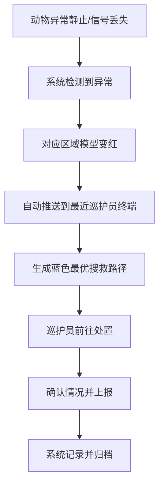
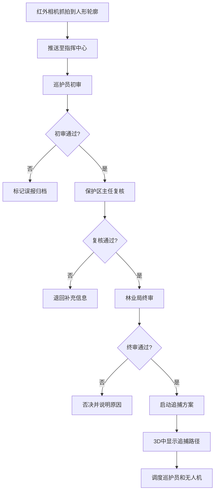
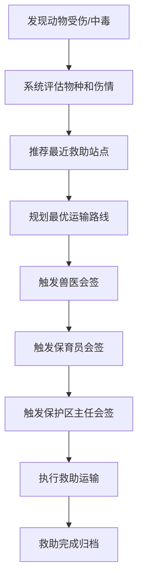

## 1. 产品概述

面向大型野生动物保护区的3D交互可视化反盗猎与生态监测调度平台，通过三维地图实时展示保护区全景，实现动物监测、巡护调度、盗猎预警、红外相机识别、无人机巡检、动物救助等全流程智能化管理，构建"天地人"一体化的生态保护体系。

- **核心价值**：提升保护区反盗猎效率，降低野生动物伤亡率，实现生态监测数字化转型
- **目标用户**：巡护员、保护区主任、林业局管理人员
- **应用场景**：日常巡护调度、盗猎事件应急响应、动物救助指挥、生态数据统计分析

## 2. 核心功能

### 2.1 用户角色

| 角色 | 登录方式 | 核心权限 |
|------|----------|----------|
| 巡护员 | 人脸识别登录 | 查看个人任务、处理预警工单、初审异常事件、查看巡护轨迹 |
| 保护区主任 | 人脸识别登录 | 全局调度、复核异常事件、审批追捕方案、查看所有数据 |
| 林业局 | 人脸识别登录 | 终审追捕方案、查看全局统计数据、导出监测报告 |

### 2.2 功能模块

1. **3D全景地图**：核心栖息地、巡护步道、红外相机监测点、无人机起降坪、指挥中心
2. **动物监测系统**：实时定位、轨迹追踪、生理状态（心率、体温）、活动热区图、族群动态
3. **预警系统**：异常静止预警、信号丢失预警、自动推送最近巡护员、最优搜救路径
4. **偷猎风险热力图**：红黄绿三级风险、历史案发数据+人流量计算、红色风险自动调度无人机
5. **红外相机监测**：编号/电量/存储/抓拍记录、人形轮廓识别、三级审批、追捕路径
6. **巡护员管理**：实时定位、当班时长、轨迹回放、信号盲区预警
7. **无人机巡检**：定期自动巡航、盗猎陷阱识别、销毁工单、绿色路径动画
8. **动物救助系统**：救助站点推荐、最优运输路线、三级电子会签
9. **数据导出**：按日期/物种导出Excel日报、活动分布/触发次数/出勤统计/盗猎事件

### 2.3 页面详情

| 页面名称 | 模块名称 | 功能描述 |
|----------|----------|----------|
| 登录页 | 人脸识别登录 | 人脸识别登录、角色选择、操作日志记录 |
| 指挥中心主页面 | 3D全景地图 | 可旋转缩放的3D保护区场景，包含所有监测要素 |
| 指挥中心主页面 | 左侧信息面板 | 动物列表、巡护员列表、预警列表、工单列表 |
| 指挥中心主页面 | 右侧功能面板 | 数据统计、风险热力图、系统设置 |
| 动物详情弹窗 | 动物信息卡 | 物种、个体编号、生理状态、24小时活动热区图、族群动态 |
| 预警详情弹窗 | 预警处理 | 预警类型、位置信息、推送记录、搜救路径规划 |
| 红外相机详情弹窗 | 相机信息 | 编号、电池电量、存储余量、抓拍记录、人形识别结果 |
| 审批流程弹窗 | 三级审批 | 巡护员初审、保护区主任复核、林业局终审、追捕方案 |
| 工单详情弹窗 | 工单处理 | 陷阱信息、指派巡护队、销毁进度、路径动画 |
| 救助详情弹窗 | 动物救助 | 物种伤情、救助站点、运输路线、三级会签 |
| 数据导出弹窗 | 报表导出 | 日期选择、物种筛选、Excel导出预览 |

## 3. 核心流程

### 3.1 异常预警处理流程

### 3.2 盗猎事件审批流程

### 3.3 动物救助流程

## 4. 用户界面设计

### 4.1 设计风格

- **主色调**：深森林绿 (#1a4d2e) 作为主色，科技蓝 (#2563eb) 作为强调色，预警红 (#dc2626) 警示色
- **辅色调**：森林绿系渐变、深灰背景、金色 (#d97706) 点缀
- **按钮风格**：圆角矩形、微立体效果、悬停时发光动效
- **字体**：标题使用思源黑体 Bold，正文使用思源黑体 Regular，数字使用等宽字体
- **布局风格**：左侧信息面板 + 中央3D场景 + 右侧统计面板的三栏布局
- **图标风格**：线性图标 + 填充图标结合，深色模式下高对比度

### 4.2 3D场景设计

- **环境**：黄昏/黎明氛围，柔和的全局光照，体积雾增加空间感
- **地形**：起伏的山地地形，覆盖森林植被，河流蜿蜒穿过
- **灯光**：方向光模拟太阳光，点光源模拟设施灯光，发光效果突出监测点
- **相机**：默认俯瞰视角，支持轨道控制旋转缩放，可切换到第一人称视角
- **交互**：点击模型显示详情，悬停高亮，路径动画流畅
- **后处理**：Bloom发光效果，轻微色调映射，景深突出重点

### 4.3 页面设计概览

| 页面名称 | 模块名称 | UI元素 |
|----------|----------|--------|
| 指挥中心 | 3D场景 | 地形、动物模型、巡护员模型、无人机、相机点、路径动画、热力图 |
| 指挥中心 | 左侧面板 | 动物列表卡片、预警列表、工单列表、可折叠 |
| 指挥中心 | 右侧面板 | 数据统计图表、风险等级指示、系统控制按钮 |
| 指挥中心 | 顶部栏 | logo、时间、当前用户、消息通知、角色切换 |
| 详情弹窗 | 信息卡 | 渐变背景、数据指标、图表、操作按钮 |
| 审批弹窗 | 流程条 | 三级审批进度条、审批意见输入框、通过/否决按钮 |

### 4.4 响应式设计

- 桌面端优先设计（1920x1080及以上）
- 支持平板横屏适配（1024px以上）
- 侧边栏可折叠以适应小屏幕
- 弹窗在小屏幕上改为全屏模式
