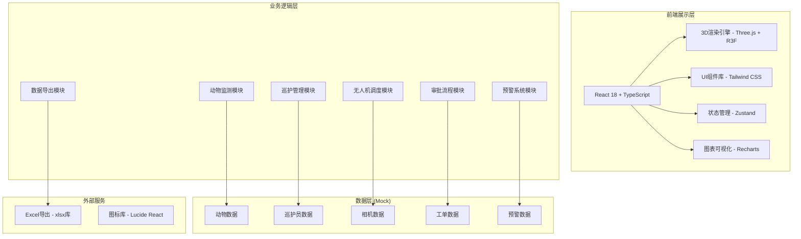
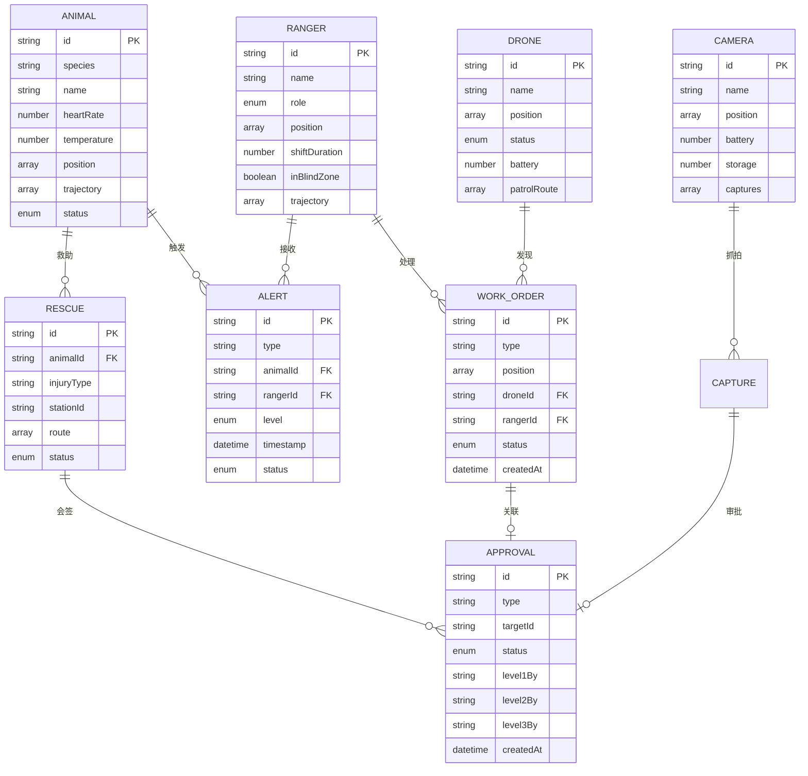

## 1. 架构设计



## 2. 技术描述

- **前端框架**: React 18 + TypeScript
- **构建工具**: Vite
- **3D引擎**: Three.js + @react-three/fiber + @react-three/drei + @react-three/postprocessing
- **样式方案**: Tailwind CSS 3
- **状态管理**: Zustand
- **图表库**: Recharts
- **Excel导出**: xlsx
- **图标库**: lucide-react
- **后端**: 无后端，使用Mock数据模拟
- **路由**: React Router DOM

## 3. 目录结构

```
src/
├── components/          # 通用组件
│   ├── ui/             # 基础UI组件
│   │   ├── Button.tsx
│   │   ├── Modal.tsx
│   │   ├── Card.tsx
│   │   └── ProgressBar.tsx
│   ├── panels/         # 面板组件
│   │   ├── LeftPanel.tsx
│   │   ├── RightPanel.tsx
│   │   └── TopBar.tsx
│   └── modals/         # 弹窗组件
│       ├── AnimalDetail.tsx
│       ├── AlertDetail.tsx
│       ├── CameraDetail.tsx
│       ├── ApprovalFlow.tsx
│       ├── WorkOrderDetail.tsx
│       ├── RescueDetail.tsx
│       └── ExportReport.tsx
├── pages/              # 页面组件
│   ├── Login.tsx       # 登录页
│   └── Dashboard.tsx   # 指挥中心主页
├── store/              # 状态管理
│   ├── useAuthStore.ts
│   ├── useAnimalStore.ts
│   ├── useRangerStore.ts
│   ├── useCameraStore.ts
│   ├── useAlertStore.ts
│   ├── useDroneStore.ts
│   └── useWorkOrderStore.ts
├── scenes/             # 3D场景组件
│   ├── Scene.tsx       # 主场景
│   ├── Terrain.tsx     # 地形
│   ├── Habitat.tsx     # 栖息地
│   ├── Animals.tsx     # 动物群
│   ├── Rangers.tsx     # 巡护员
│   ├── Cameras.tsx     # 红外相机
│   ├── Drones.tsx      # 无人机
│   ├── PatrolPaths.tsx # 巡护步道
│   ├── HeatMap.tsx     # 热力图
│   └── PathLines.tsx   # 路径线
├── data/               # Mock数据
│   ├── animals.ts
│   ├── rangers.ts
│   ├── cameras.ts
│   ├── drones.ts
│   ├── alerts.ts
│   ├── workOrders.ts
│   └── rescueStations.ts
├── types/              # TypeScript类型定义
│   ├── animal.ts
│   ├── ranger.ts
│   ├── camera.ts
│   ├── drone.ts
│   ├── alert.ts
│   ├── workOrder.ts
│   └── user.ts
├── utils/              # 工具函数
│   ├── pathfinding.ts  # 路径规划
│   ├── excel.ts        # Excel导出
│   ├── heatmap.ts      # 热力图计算
│   └── helpers.ts
├── hooks/              # 自定义Hooks
│   ├── useAnimation.ts
│   └── useClock.ts
├── App.tsx
├── main.tsx
└── index.css
```

## 4. 路由定义

| 路由 | 页面 | 说明 |
|------|------|------|
| /login | 登录页 | 人脸识别登录，角色选择 |
| /dashboard | 指挥中心 | 主页面，3D场景+左右面板 |
| * | 重定向到登录页 | 默认路由 |

## 5. 数据模型

### 5.1 实体关系图



### 5.2 核心类型定义

```typescript
// 动物
interface Animal {
  id: string;
  species: string;
  name: string;
  heartRate: number;
  temperature: number;
  position: [number, number, number];
  trajectory: [number, number, number][];
  status: 'normal' | 'warning' | 'danger' | 'lost';
  groupId: string;
  stationaryTime: number;
}

// 巡护员
interface Ranger {
  id: string;
  name: string;
  role: 'ranger' | 'director' | 'bureau';
  position: [number, number, number];
  shiftDuration: number;
  inBlindZone: boolean;
  blindZoneTime: number;
  trajectory: [number, number, number][];
}

// 红外相机
interface Camera {
  id: string;
  name: string;
  position: [number, number, number];
  battery: number;
  storage: number;
  captures: Capture[];
  hasHumanDetection: boolean;
}

// 无人机
interface Drone {
  id: string;
  name: string;
  position: [number, number, number];
  status: 'idle' | 'patrolling' | 'alert';
  battery: number;
  patrolRoute: [number, number, number][];
  currentRouteIndex: number;
}

// 预警
interface Alert {
  id: string;
  type: 'stationary' | 'lost_signal' | 'poaching' | 'intrusion';
  animalId?: string;
  cameraId?: string;
  position: [number, number, number];
  level: 'low' | 'medium' | 'high' | 'critical';
  timestamp: Date;
  status: 'pending' | 'processing' | 'resolved' | 'false_alarm';
  assignedRangerId?: string;
  searchPath: [number, number, number][];
}

// 工单
interface WorkOrder {
  id: string;
  type: 'trap_destruction' | 'rescue' | 'patrol';
  position: [number, number, number];
  droneId?: string;
  assignedRangerId?: string;
  status: 'pending' | 'assigned' | 'in_progress' | 'completed';
  createdAt: Date;
  routePath: [number, number, number][];
}

// 审批
interface Approval {
  id: string;
  type: 'poaching' | 'rescue' | 'patrol';
  targetId: string;
  status: 'pending_level1' | 'pending_level2' | 'pending_level3' | 'approved' | 'rejected';
  level1By?: string;
  level1Comment?: string;
  level1At?: Date;
  level2By?: string;
  level2Comment?: string;
  level2At?: Date;
  level3By?: string;
  level3Comment?: string;
  level3At?: Date;
  chasePath?: [number, number, number][];
}
```

## 6. 核心算法

### 6.1 路径规划算法
- 使用简化的A*算法在地形网格上计算最短路径
- 考虑地形高度、障碍物（河流、悬崖）的通行代价
- 生成的路径用贝塞尔曲线平滑处理

### 6.2 热力图生成
- 基于历史案发数据点进行高斯核密度估计
- 叠加实时人流量权重
- 输出红黄绿三级风险区域（红色>0.7，黄色0.3-0.7，绿色<0.3）

### 6.3 异常检测
- 动物静止检测：位置变化小于阈值持续15分钟
- 信号丢失检测：定位数据更新间隔超过5分钟
- 巡护员盲区检测：进入预设盲区超过30分钟
